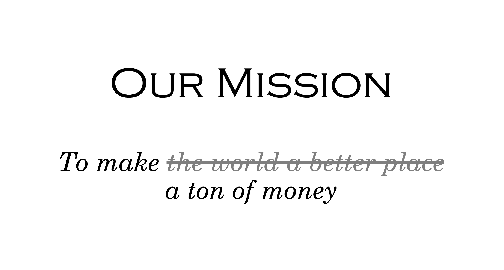

<!-- _class: lead, invert -->

# Coding Challenges

---

# Setting the scene

We've all left our _cushy bank jobs_...

To start a _business-to-business Software as a Service_ startup!

But we need to **get funded** and **find some clients**.

---

# An exclusive party

We've got wind of an **exclusive IPO party** tonight.

All of the Valley's _VIP investors_ will be there.

We just need to **get in**...

---

# The password

The bouncer will only let us in if we know the **password**.

But he's a nice guy really! He wants to _help a new business_.

So he gives us a _hint_ about the password...

---

# A clue

> "Psst, I'll let you in on a little _secret_!"

The password is an **English word**!

Luckily, you're carrying a _dictionary_ around.

As one does at a party.

---

# The challenge

Given _two inputs_:

- `guess(word: string): Promise<boolean>`
  A _function_ that takes a **word** and returns `true` or `false`.
- `dictionary: string[]`
  An _array_ of just over 370,000 **English words**.

**Find the password**.

---

# The bottleneck

The bouncer may be nice, but he has _limits_.

> "_370,000 words?!_ We don't have all night!"

A queue of partygoers is forming behind us.

And they're getting **impatient**...

---

# Twenty Questions

You only have enough time to guess **20 words**.

But he still wants to _help us_, so he'll make things a little _easier_...

"This time, if you guess incorrectly, I'll tell you whether the password comes **before** or **after** the word you just guessed, in **alphabetical order**."

---

# The challenge

Similarly to before, we are given _two inputs_:

- `guess(word: string): Promise<'correct' | 'before' | 'after'>`
  A _function_ that takes a **word** and returns:
  - `'correct'` if the word is correct;
  - `'after'` if the password comes _after_ the guessed word;
  - `'before'` if the password comes _before_ it.
- `dictionary: string[]`
  An _array_ of just over 370,000 **English words**.

Find the password in **no more than 20 guesses**.

---

# The Social Network

We've spotted a famous venture capitalist:

**Monica Hall**!

Let's _talk to her_.

But Monica doesn't talk to _just anyone_.

And besides, we're _socially-awkward engineers_.

We don't talk to **strangers**...

---

# Degrees of separation

They say everyone is linked by _at most 6 people_.

Monica might be a _friend of a friend of a friend_...

Could we reach her via **mutual friends**?

---

# An introduction

Find the smallest _degree of separation_, via other guests, between you and Monica.

So if she were a _friend of a friend of a friend_, the degree would be **3**.

Assume that friendships are _bidirectional_:

> "If you're my friend, then I'm your friend".

---

# The challenge

Given _one input_:

- `getFriends(name: string): string[]`
  A _function_ that takes **a person's name**,  
  and returns an _array_ of names of their **friends** at the party.

Calling `getFriends('Me')` returns _your friends_. That's a start!

Find the **minimum degree of separation**.

---

# Wait... what was that _name_ again?

So we know the _degree of separation_.

But we're bad at **remembering names**.

We've _forgotten_ those mutual friends' ones already!

Modify the solution to return **an array of names** of the people on the shortest path, in order of connection.

---

# Success!

Monica liked our idea and has promised us a _seed round!_.

_We should talk to drunk VCs more often..._

But it barely covers our _initial costs_.

We'd better **become profitable** quickly!

---

# Our mission

How can we _make as much money as we can?_

We need a **business plan**.

---

# Finding clients

We've done our _networking_.

We've found **40 potential clients**.

The money we can make from a company depends on its _number of employees_.

---

# A plan!

Imagine that our **salesperson** can acquire **one new client per month**.

And we charge a one-off fee of **$500 per employee**.

How much can we make in **24 months**?

Perhaps it pays to _be greedy_...

---

# Maximum money: Easy mode

Given _one input_:

- `employees: number[]`
  An _array_ of numbers of employees per company.

Give the **maximum amount** we can make in **24 months**.

---

# Complicated clients

But if life were that simple, _we'd all be millionaires_...

In reality, some companies are _difficult_.

Convincing them could take **more than a month**.

Our busy salesperson can only negotiate with **one company at a time**.

---

# Maximum money: Normal mode

Given _two inputs_:

- `employees: number[]`
  An _array_ of numbers of employees per company.
- `months: number[]`
  An _array_ of the numbers of months required to make a sale to each company.  
  (_Whole numbers_)

Give the **maximum amount we can make** in **24 months**.

And do it _efficiently_. We need to be _quick_!

---

# An alternative strategy

But could we do better with a _monthly subscription model_?

Market research shows we can charge **$50 per employee per month**.

_How much could we make this way?_

---

# Maximum money: (NP-)Hard mode

Given _two inputs_:

- `employees: number[]`
  An _array_ of numbers of employees per company.
- `months: number[]`
  An _array_ of the numbers of months required to make a sale to each company.  
  (_Whole numbers_)

Give the **maximum amount** we can make in **24 months** with **monthly subscriptions**.

Your code should _~~be efficient~~ at least not take all day_.

---

# An alternative strategy

Looking **promising**!

But our sales rep is getting _overworked and stressed_.

But if we hired **more salespeople**, we could acquire clients **more quickly**.

Each **additional salesperson** allows us to acquire clients **1 month sooner**  
(With a **minimum time** of one **month**)

---

# Time to hire!

Our original salesperson is happy being paid in _equity_...

But candidates want a **salary** of **$120k per year**.

Salaries are paid **monthly**.

Hiring and training a salesperson takes **one month**, takes up **all current salepeople's** time, and costs a **$20k** one-off recruiter's fee.

We can hire _as many as we need and can afford_.

---

# Maximum money: Silly mode

Given _two inputs_, just like before:

- `employees: number[]`
  An _array_ of numbers of employees per company.
- `months: number[]`
  An _array_ of the numbers of months required to make a sale to each company.

Give the **maximum amount** we can make in **24 months** with **monthly subscriptions** and the ability to **hire salespeople**?

Your code should _~~be efficient~~ not kill your computer_.
